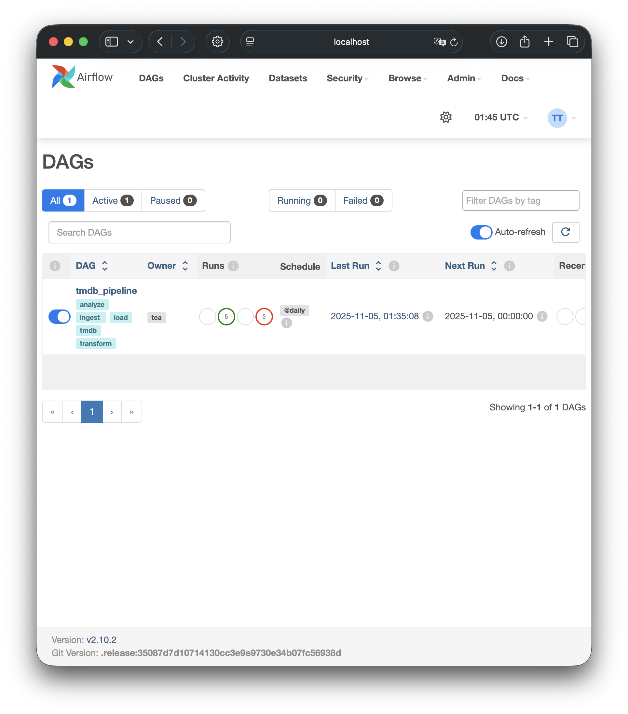
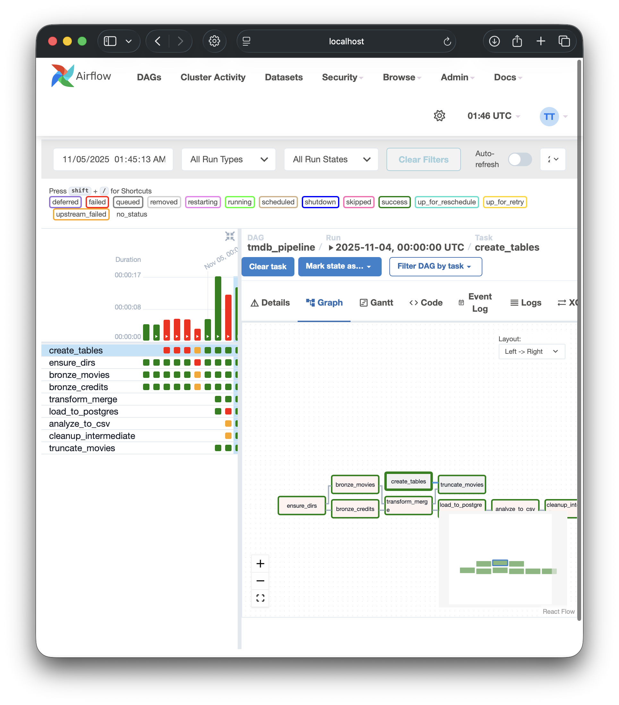

# TMDB Airflow Pipeline

**Author:** Tea Tafaj  
**Environment:** Apache Airflow 2.10.2 (Python 3.11) + Postgres 13  
**Repository:** https://github.com/TeaTafaj/Airflow_Assignment.git
**Status:** ✅ Successful DAG Run

---

## 📋 Table of Contents
1. [Overview](#overview)
2. [Pipeline Workflow](#pipeline-workflow)
3. [Dataset Description](#dataset-description)
4. [Project Structure](#project-structure)
5. [Technical Stack](#technical-stack)
6. [DAG Architecture](#dag-architecture)
7. [Execution Steps](#execution-steps)
8. [Results](#results)
9. [Parallelism & XCom Design](#parallelism--xcom-design)
10. [Screenshots](#screenshots-for-submission)


---

##  Overview
This project builds an **end-to-end data pipeline** using **Apache Airflow** to automate the ingestion, transformation, loading, and analysis of **The Movie Database (TMDB)** datasets. The DAG demonstrates:
- Parallel task execution.
- Proper task dependencies and cleanup.
- Data versioning through layered storage (Raw → Bronze → Silver → Outputs).
- SQL integration via the PostgresOperator.

---

##  Pipeline Workflow
1. **Ingest Data**: Reads two CSVs from `/data/raw/`.
2. **Bronze Stage**: Cleans and validates both datasets (movies and credits).
3. **Silver Stage**: Merges the two cleaned datasets into one enriched dataset.
4. **Load to Postgres**: Creates a schema + table, truncates, then loads new data.
5. **Analysis**: Aggregates top genres by average rating and exports to CSV.
6. **Cleanup**: Deletes intermediate files to maintain a tidy workspace.

---

##  Dataset Description
Source: [Kaggle TMDB 5000 Movie Dataset](https://www.kaggle.com/datasets/tmdb/tmdb-movie-metadata)  

| File | Description |
|------|--------------|
| `tmdb_5000_movies.csv` | Core movie metadata including vote counts, genres, popularity, etc. |
| `tmdb_5000_credits.csv` | Cast and crew details, including `movie_id` as key. |

---

##  Project Structure
```
airflow-tmdb/
├─ dags/
│  └─ tmdb_pipeline.py
├─ include/
│  └─ sql/
│     └─ create_tables.sql
├─ data/
│  ├─ raw/
│  │  ├─ tmdb_5000_movies.csv
│  │  └─ tmdb_5000_credits.csv
│  ├─ bronze/
│  ├─ silver/
│  └─ outputs/
│     └─ top_genres_by_rating.csv
├─ .devcontainer/
│  ├─ docker-compose.yml
│  ├─ Dockerfile
│  └─ db.env
└─ requirements.txt
```

---

##  Technical Stack
| Component | Purpose |
|------------|----------|
| **Apache Airflow** | Orchestration & task scheduling |
| **PostgreSQL** | Persistent data storage |
| **Docker Compose** | Containerized setup for Airflow + Postgres |
| **Pandas** | Data transformations |
| **Python 3.11** | Core logic and scripting |

---

##  DAG Architecture
```text
create_tables
 │
 └── ensure_dirs
      ├── bronze_movies
      ├── bronze_credits
           │
           └── transform_merge
                └── truncate_movies
                     └── load_to_postgres
                          └── analyze_to_csv
                               └── cleanup_intermediate
```

- **Parallel branches** for movies and credits ingestion.
- **Transform step** depends on both bronze tasks.
- **Cleanup** runs last to maintain a clean workspace.

---

##  Execution Steps
### Run the pipeline locally
```bash
# 1️⃣ Start Airflow and Postgres containers
cd .devcontainer
docker compose up -d

# 2️⃣ Access Airflow UI
http://localhost:8080  
Login → Username: admin | Password: admin

# 3️⃣ Enable & trigger the DAG
Click toggle → ▶️ Trigger DAG → Wait for green tasks

# 4️⃣ Verify output
cd .devcontainer
docker compose exec airflow bash -lc "ls -la /opt/airflow/data/outputs && head -n 10 /opt/airflow/data/outputs/top_genres_by_rating.csv"
```

---

##  Results
Example output (`data/outputs/top_genres_by_rating.csv`):
```
genre,n_movies,avg_vote
Adventure,356,7.02
Drama,510,6.91
Animation,122,6.84
Action,420,6.73
```

---

##  Parallelism & XCom Design
- **Parallel tasks:** `bronze_movies` and `bronze_credits` run simultaneously to improve runtime.
- **XCom usage:** Only **file paths** (strings) are passed between tasks — never raw data.
- **Dependencies:** Downstream tasks wait only on the files they need.

---

##  Screenshots
1. **Airflow DAGs page** — showing `tmdb_pipeline` enabled.

2. **Graph View** — all tasks green.



---

**End of README**  
🩵 _Duke MIDS — Data Engineering Assignment, Fall 2025_

